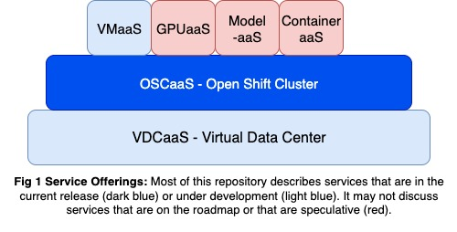

# Open Sovereign AI Cloud

## Structure

[Features](features/): Description of key features and capabilities, some of
which may not yet be implemented.

[Architecture](architecture/): Description of components, how they work
together, and the design decisions that have been made.

## Introduction

There is a worldwide trend towards Sovereign AI Clouds (SACs), where countries
and corporations want to have their own clouds with their own rules. This
document presents a high-level overview of Open Sovereign AI Cloud (O-SAC), an
open source solution for organizations standing up their own clouds. A solution
here means that the offering:

1. includes a complete set of technologies and components
2. is prescriptive in only using validated components and technologies

A validated component or technology is one that we have, potentially with a
partner, integrated successfully into the solution and demonstrated successfully
as part of the deployed solution.

An end-to-end prescriptive solution with specific technology choices (e.g.,
GPUs, switches, observability tools, billing model) is needed to solve
scalability, compliance and performance. While cloud provider environments are
highly variable, a complete end-to-end open-source solution will be valuable for
some clouds, and will hopefully provide a good starting point that others can
modify to meet their needs.

As shown in Fig1, O-SAC currently supports a multi-tenant Open Shift
Cluster (OSC)-aaS (dark blue) where tenants can easily spin up their own environment. Each tenant
has their own strongly isolated OpenShift cluster configured with the tools and
services they select from a set of provided options. Tenants and end-users have
access to the observability tools needed to debug their applications,
automation/logging needed to meet their compliance requirements, fine grained
monitoring, and cost management needed to make rational decisions about their
resource use. 

In our current release OSCaaS deployes  clusters on
physical machines, with various physical and software configuration
needed to optimize performace for the expected workloads. Relatively minor changes are needed to support
deploying OpenShift clusters on virtual machines.  Also, as we will discuss,
service provides can provided customized tempates for OSCaaS that
include installation of OpenShift AI, other sofware, and even
downloading of AI models to enable MaaS.  

Virtual Data Center (VDC)-aaS, under development, will allow tenants to allocate isolated
groups of virtual or physical computers, place those computers on networks, and manage/configure
those computers themselves.  Physical machines are needed, for example, by tenants that
want to install their own cluster software (e.g., SLURM).  Virtual
machines can be used by developers that
are, for example, working on upstream k8s, or enterprise customers
that require complex network topoligies like VMware's VCloud
Director. 

Most of the development has so far focused on the lower layer services as a
basis for a rich set of higher level services that are in plan. The one higher
level service that is today under development, VMaaS, will allow users to spin
up their own individual VMs. 

O-SAC is being developed and continuously deployed at the [Mass Open
Cloud](https://massopen.cloud/) (MOC) to take advantage of the MOC’s scale, to
provide industry and academic partners a public environment where they can
integrate their hardware and services into the solution, and to ensure the
solution can address the needs of a production environment with a large
community of AI users. O-SAC began with contributions from the MOC, Red Hat
Ecosystem Engineering, Red Hat Research, and IBM Research, and hopes to attract
a broader community of developers and early adopters that will help prioritize
and help develop features.

## Terms and Definitions

MOC: The MassOpen Cloud (MOC) is a public computing cloud where the Open
Sovereign AI Cloud is being deployed.

Cloud Provider: Cloud providers are organizations that offer compute resources
for rent to multiple unrelated tenants / customers.

Tenant: A user or group of people with the ability to self-service provision
clusters; acts as a cluster administrator for their own cluster(s). An end user
of the O-SAC solution.

Tenant Cluster: An running OpenShift cluster requested by a tenant.

HCP: (HyperShift) Hosted Control Plane refers to an architecture where the
control plane of a Kubernetes cluster is decoupled from the worker nodes and
hosted separately, often on a different infrastructure managed by a cloud
provider or a separate cluster. 

ACM: Advanced Cluster Management (ACM) is a Red Hat product that simplifies the
provisioning and management of multiple Kubernetes (OpenShift) clusters.

GDPR: The General Data Protection Regulation (GDPR), is a European Union law
focused on data protection and privacy for individuals within the EU. O-SAC will
have to comply with these regulations.

## Contribution Guide

The "(AI [Factory]|Cloud) Inna Box" [organization on
GitHub](https://github.com/innabox) is a public location to plan and develop
this solution. It contains a [list of
issues](https://github.com/innabox/issues/issues) driving our work as well as
this document and [additional documentation](https://github.com/innabox/docs). 

To contribute to the project, first find or open an issue on
https://github.com/innabox/issues. Prior to beginning work, it is wise to get
feedback from project stakeholders on the change and how it will be implemented.
Then fork the repository you’re interested in contributing to, clone it to your
local machine, and create a descriptive feature branch name. Once you’ve made
your changes and ensured that it passes any lint checks, push and open a pull
request against main on the upstream repo, linking the issue you opened and
summarizing what you changed. Then your pull request will eventually be
reviewed, and you can respond to comments, add follow-up commits, and re-run
tests until all required checks are green. If the team accepts the pull request,
your contribution will be merged and you will have successfully contributed to
the O-SAC project.
